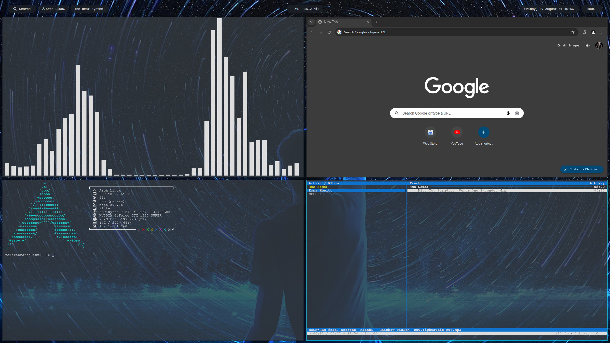

# ArchLinux
Здесь находятся мои конфиги и настройки оконного менеджера bspwm.

Используемые пакеты:
* chromium
* neofetch
* kitty
* polybar
* rofi
* picom
* feh
* cava
* cmus

## Комбинации клавиш
* Win + q                 - Запуск терминала kitty
* Win + r                 - Запуск меню Rofi
* Win + Shift + p         - Выключение системы
* Win + Shift + r         - Перезагрузка системы
* Win + f                 - Запуск браузера Chromium
* Win + i                 - Запуск cava
* Win + a                 - Запуск cmus
----
* Win + c                 - Закрыть окно
* Win + v                 - Перевести окно в плавающий режим

## Смена обоев
В файле bspwmrc есть строка "feh --bg-fill ~/Images/night.jpg", в которой нужно изменить путь до изображения на свой.
